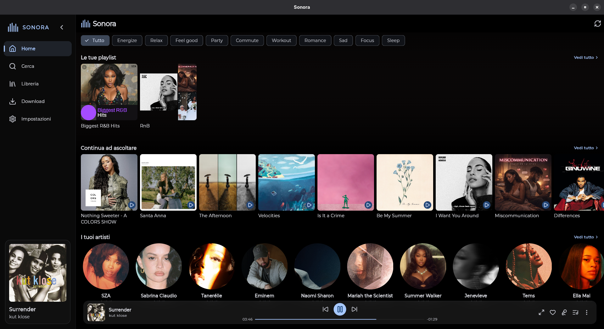
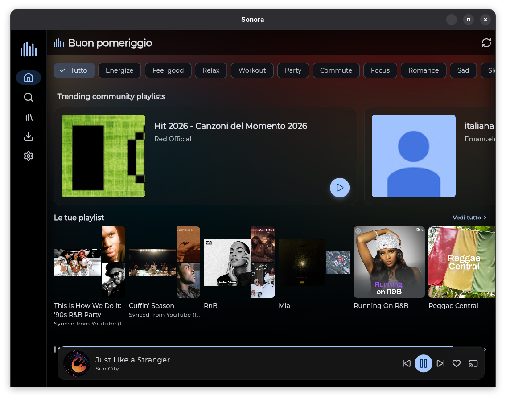
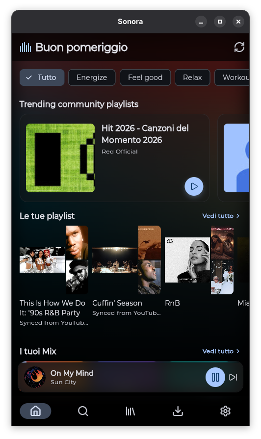
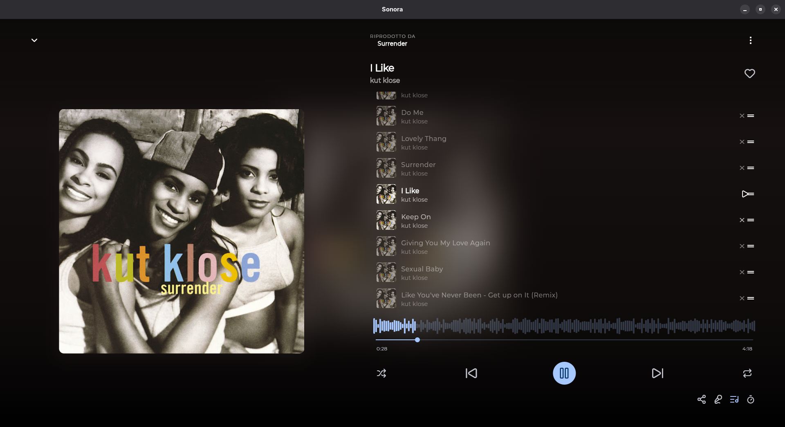
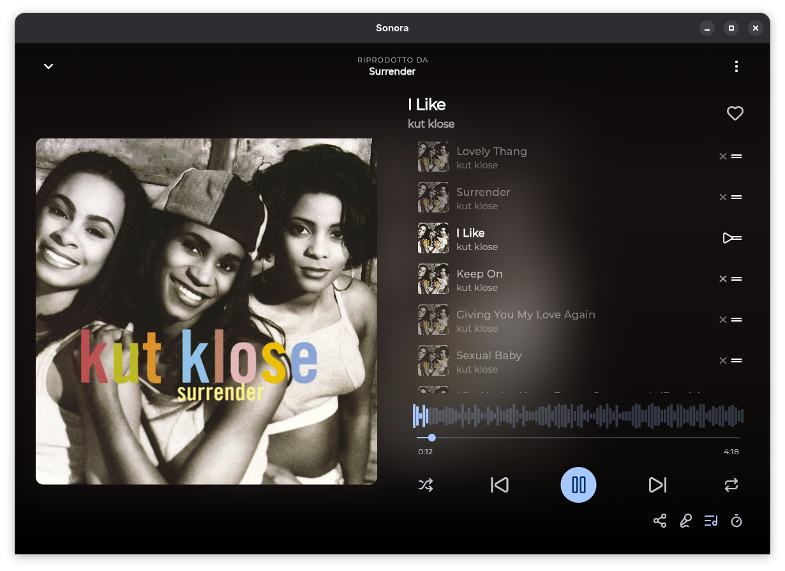
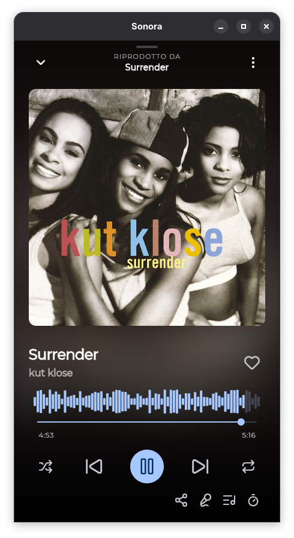

<picture>
  <source media="(prefers-color-scheme: dark)" srcset="assets/logo_full.svg">
  
</picture>

Sonora is a cross-platform music streaming app built with Flutter. It uses **YouTube Music** as its data source, offering a rich and customizable listening experience on **Android** and **Linux desktop**.

[](LICENSE)


---

## Screenshots

| Wide (desktop) | Tablet | Mobile |
|----------------|--------|--------|
|  |  |  |
|  |  |  |

---

## Features

- **YouTube Music streaming** — search, browse, and play songs, albums, artists, and playlists directly from YouTube Music
- **Background playback** — keep listening while using other apps, with a persistent notification on Android
- **Android Auto** — full driving support with playback controls, browse, and sleep timer
- **Offline downloads** — save songs locally for offline listening
- **Local library** — save favorite songs, albums, artists, and playlists; create custom playlists
- **Listening history** — track your listened songs
- **Search** — search songs, albums, artists, playlists, and music videos
- **Adaptive UI** — optimized layouts for mobile, tablet, and wide screens (NavigationBar / NavigationRail / NavigationDrawer)
- **Themes** — light, dark, and AMOLED themes, with Dynamic Color support on Android 12+
- **Crossfade** — smooth transitions between songs (configurable duration)
- **Sleep timer** — stop playback after a set time
- **Linux desktop** — system tray, MPRIS global controls (D-Bus), resizable window
- **Auto-update** — automatic update check via GitHub Releases
- **Headless CLI** — control Sonora from the terminal: search, play, download, and manage library without the GUI
- **Backup & restore** — export and import your local library
- **Localization** — Italian and English

---

## Supported Platforms

| Platform | Status |
|----------|--------|
| Android  | ✅ (API 24+) |
| Linux    | ✅ (x64) |
| Windows  | ❌ (not planned) |
| macOS    | ❌ (not planned) |
| iOS      | ❌ (not planned) |

---

## Tech Stack

| Component | Library |
|-----------|---------|
| **Framework** | Flutter 3.44+ |
| **State Management** | Riverpod 3.x |
| **Navigation** | go_router 17.x |
| **Local Database** | Drift (ex Moor) |
| **Audio Playback** | just_audio + audio_service |
| **Linux Audio** | just_audio_media_kit + media_kit |
| **YouTube Music API** | [dart_ytmusic_api](https://github.com/gmstyle/dart_ytmusic_api) |
| **Stream URL** | youtube_explode_dart |
| **Themes** | dynamic_color, palette_generator |
| **Downloads** | Dio |
| **CLI** | args 2.x |
| **Notifications** | flutter_local_notifications |

### Architecture

Clean Architecture with three layers:

```
lib/
├── core/          # Constants, themes, utilities, extensions
├── data/          # Data sources (remote YTM, local Drift) + repository implementations
├── domain/        # Models, repository interfaces, use cases
├── presentation/  # Riverpod providers, widgets, screens, router
└── l10n/          # EN / IT localization
```

---

## Getting Started

### Prerequisites

- Flutter SDK 3.44+ (stable channel)
- Android Studio (for Android builds)
- Linux: `clang`, `cmake`, `ninja`, `libgtk-3-dev`, `pkg-config`

### Build from Source

```bash
git clone https://github.com/gmstyle/sonora.git
cd sonora

# Generate Drift code
dart run build_runner build --delete-conflicting-outputs

# Generate localizations
flutter gen-l10n

# Run in debug mode
flutter run

# Android release build
flutter build apk --release

# Linux release build
flutter build linux --release
```

### Headless CLI

```bash
curl -fsSL https://raw.githubusercontent.com/gmstyle/sonora/dev/install.sh | bash
sonora search "the beatles" --limit 5
```

See [CLI documentation](docs/CLI.md) for all commands and options.

---

## Download

Download the latest release from [GitHub Releases](https://github.com/gmstyle/sonora/releases/latest):

- **Android**: signed APK ready to install
- **Linux**: `sonora-linux-x64.tar.gz` with install scripts

---

## Development

- [CLI documentation](docs/CLI.md) — headless terminal usage: search, play, download, library, history
- [Developer documentation](docs/SONORA-DEV-DOCS.md) — detailed guide on architecture, database, audio engine, and conventions
- Report bugs or request features via [GitHub Issues](https://github.com/gmstyle/sonora/issues)
- Pull requests are welcome!

### Useful Commands

```bash
flutter analyze                                          # Static analysis
flutter test                                             # Run tests
dart run build_runner build --delete-conflicting-outputs  # Regenerate Drift code
flutter gen-l10n                                         # Regenerate localizations
```

---

## License

Distributed under the MIT License. See [LICENSE](LICENSE) for more information.
