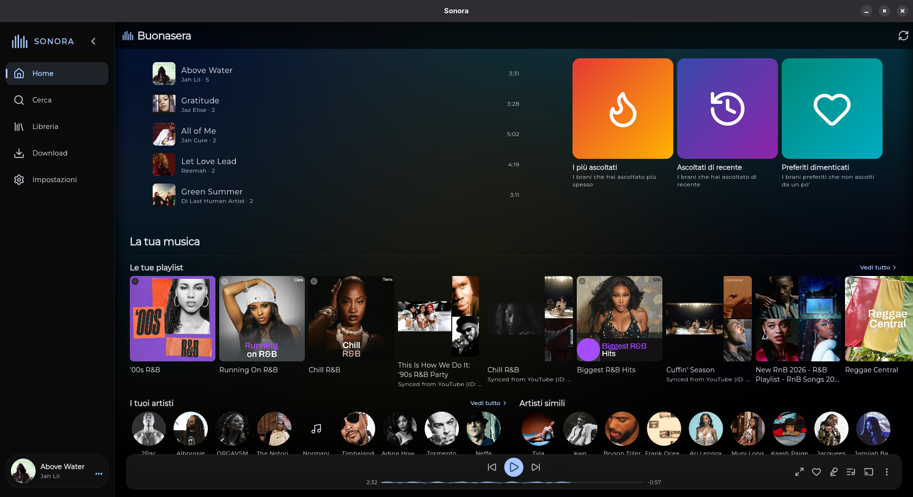
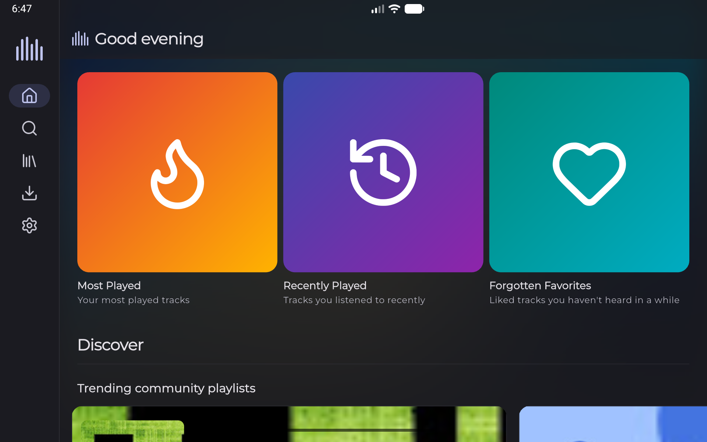
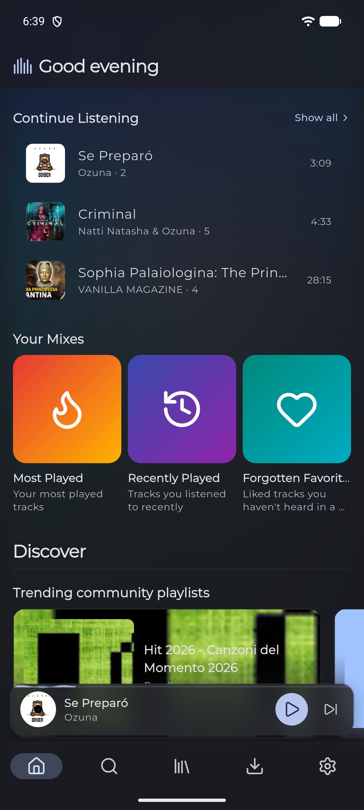
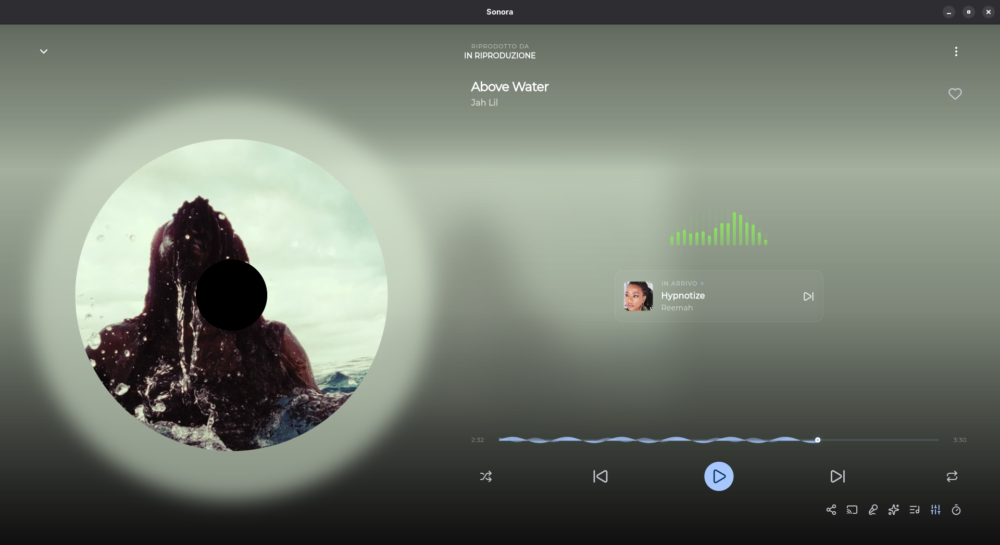
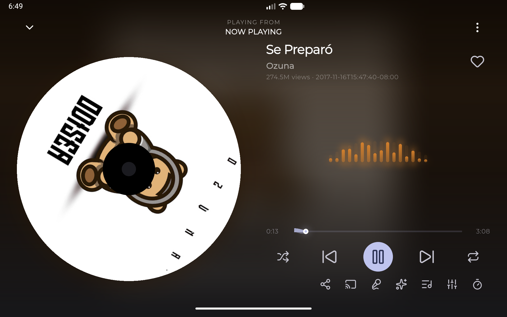
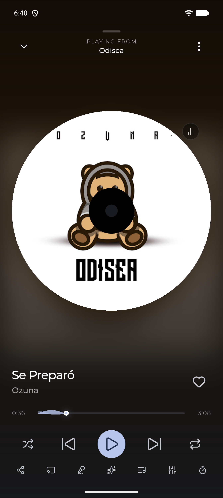

<picture>
  <source media="(prefers-color-scheme: dark)" srcset="assets/logo_full.svg">
  
</picture>

Sonora is a cross-platform music and video streaming app built with Flutter. It uses **YouTube Music** as its data source, offering a rich and customizable experience on **Android** and **Linux desktop**.

[](LICENSE)

[](https://github.com/gmstyle/sonora/releases)
[](https://github.com/gmstyle/sonora/releases/latest)

## Screenshots

| Wide (desktop) | Tablet | Mobile |
|----------------|--------|--------|
|  |  |  |
|  |  |  |

## Donate

If you enjoy Sonora and want to support its development, a small donation is always appreciated:

[](https://paypal.me/gmstyle)

---

## Features

**Playback**
- YouTube Music streaming for songs, albums, artists, playlists, music videos, podcasts, and episodes
- Audio and video playback, background play, crossfade, 5-band equalizer, and sleep timer
- Related songs in the player, casting to Chromecast and DLNA, Android Auto (Home, Library, Mixes, Explore, Charts & Moods, podcasts)

**Library & offline**
- Local library for favorites, playlists, subscribed podcasts, and saved episodes
- YouTube playlist import/sync, smart mixes from listening history, typed history
- Downloads, explicit offline mode, and a connectivity banner when the network drops

**Explore**
- Charts, Moods & Genres, and New Releases
- Podcast and episode pages, user/channel pages, search across songs, videos, podcasts, and users

**Desktop & extras**
- Adaptive layouts (phone, tablet, wide) with light, dark, and AMOLED themes (Dynamic Color on Android 12+)
- Linux tray and MPRIS; auto-update from GitHub Releases with in-app release notes
- Headless CLI, backup/restore, P2P library sync over Wi-Fi, Sonora Wrapped stats, Italian and English

---

## Supported Platforms

| Platform | Status |
|----------|--------|
| Android  | ✅ (API 24+) |
| Linux    | ✅ (x64) |
| Windows  | ❌ (not planned) |
| macOS    | ❌ (not planned) |
| iOS      | ❌ (not planned) |

---

## Download

Get the latest build from [GitHub Releases](https://github.com/gmstyle/sonora/releases/latest):

- **Android**: signed APK
- **Linux portable**: `sonora-linux-x64.tar.gz` with install scripts
- **Linux DEB**: Debian / Ubuntu
- **Linux RPM**: Fedora / RHEL

---

## Getting Started

### Prerequisites

- Flutter SDK 3.47+ (stable channel)
- Android Studio (for Android builds)
- Linux: `clang`, `cmake`, `ninja`, `pkg-config`, `libgtk-3-dev`, `liblzma-dev`, `libayatana-appindicator3-dev`, `libmpv-dev`

### Build from Source

```bash
git clone https://github.com/gmstyle/sonora.git
cd sonora

dart run build_runner build --delete-conflicting-outputs
flutter gen-l10n

flutter run

flutter build apk --release
flutter build linux --release
```

### Headless CLI

```bash
curl -fsSL https://raw.githubusercontent.com/gmstyle/sonora/dev/install.sh | bash
sonora search "the beatles" --limit 5
```

See [CLI documentation](docs/CLI.md) for all commands and options.

---

## Development

Architecture, database, audio engine, and the release pipeline are documented in [SONORA-DEV-DOCS.md](docs/SONORA-DEV-DOCS.md). Stack: Flutter 3.47+, Riverpod, go_router, Drift, media_kit, [dart_ytmusic_api](https://github.com/gmstyle/dart_ytmusic_api), youtube_explode_dart.

- [CLI documentation](docs/CLI.md)
- Report bugs or request features via [GitHub Issues](https://github.com/gmstyle/sonora/issues)
- Pull requests are welcome

```bash
flutter analyze
flutter test
dart run build_runner build --delete-conflicting-outputs
flutter gen-l10n
```

---

## License

Distributed under the MIT License. See [LICENSE](LICENSE) for more information.

## Disclaimer

Sonora is an independent project and is not endorsed by YouTube or Google. It does not collect personal data and does not host, distribute, or sell copyrighted material. All content belongs to the respective owners. Sonora is for educational purposes only. The developer does not encourage illegal activity and is not responsible for misuse of the software.
